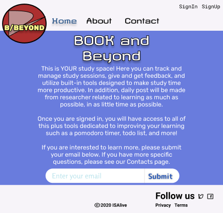
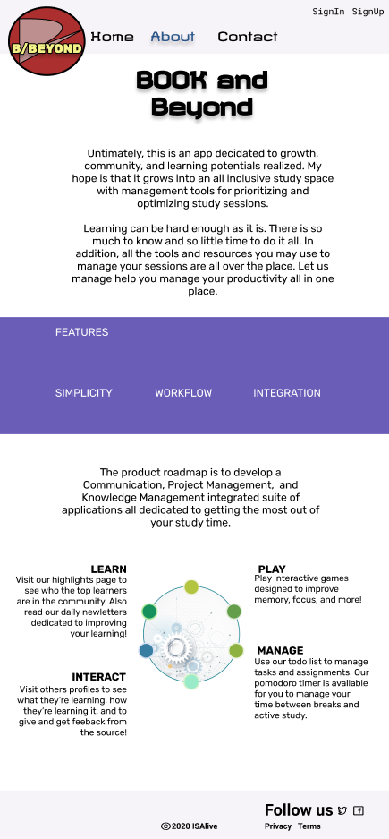
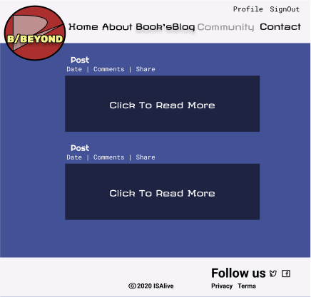

# Book's Blog App

## INTRODUCTION
I created this project to piece together some of React's greatest tools: 

* Reason-React
* Next.JS
* React-bootstrap

I was inspired to use Reason after a listening to a conference with Peter Piekarczyk (That link can be found here: https://youtu.be/7HkXVyYQ8ss). I was sold on the idea that I could create a more safe and statically typed interface for user. It is powered by OCamel which is used in many big companies that are considered serious and it is a form of TypeScript that uses BuckleScript as it's compiler, leading to faster results.

Next.Js is another big tool from React which offers both Static Site Generation, like it's counterpart Gatsby, and Sever Side Rendering. What's really cool about this framework is that besides allowing for blazing fast pages through it's pre-rendering methods, it also allows for you to use it as both a backend and frontend.

I highly recommend their tutorial found here: https://nextjs.org/learn/. I finished it in a weekend! Also checkout their github for plenty of examples.

## ADDITIONAL TECHNOLOGIES USED

In order to use ReasonML (Reason-React) you must install BuckleScript, it's compiler. The next-transpile-module is what allows ReasonML pages to be picked as a dynamic page route from Next.Js.

Auth0 is used as authentication to provide user an easy method of login through their gmail, without having to actually create a new account.

## THE PLANNING

Here are the intial designs using the tool https://figma.com/ along with the original idea for this app.

Homepage

About

Book's Blog

My initial intentions were to create an App similar to Facebook but for people to connect through learning and not random party pics or memes. This idea was also inspired by the numerous YouTuber's you can find by simply looking for: Study With Me. I was deeply impressed to find channels with over 200k views! 

The planning of making this a full scale app will take longer than the week that was allotted for this project. However, now that it is born, I am excited to watch it mature over time.

## UNSOLVED PROBLEMS

So far, the biggest obstacles have been with incorporating Reason. Some of these obstacles include:

* Limited (specialized) documentation
* Limited examples
* Learning curve
* Working with styles and other modules

So far there are very few resources in comparison to Next.Js for example. Next.Js has what appears to be hundreds of examples you can clone off github for whatever you want to accomplish. It has a tutorial and a vast amount of documentation. There are also plenty of YouTube videos. However, what you will notice is that when you look for Reason examples, especially when it comes to styling with modules like Bootstrap for example, there are very very resources.

Another complication is that it appears there are some breaking changes between updates for Next.Js v10 and Reason-React v9 and React v17. In order for this project to incorporate Reason, it required a downgrade of React and React-Dom to v16. Many of the other modules I tried to incorporate were incompatible as well or needed some tweaking.

## FUTURE ENHANCEMENTS

I want to see this app grow to be the percect study space where people can collaborate, share study methods, and overall become a more learned culture. This study space will include many of the most popular study tools such as a pomodoro timer, a goals/task list, a radio tuner for music geared towards learning, and tips on how to improve your study sessions throughout the app. 

I want Book's Blog to be my personal posting section where others can see what advice I have to offer through my own experices with accelerated learning. And I want a separate section where others can read posts from each other about what methods they are using.

In addition, users will have the ability to vote on what's working and what's not.